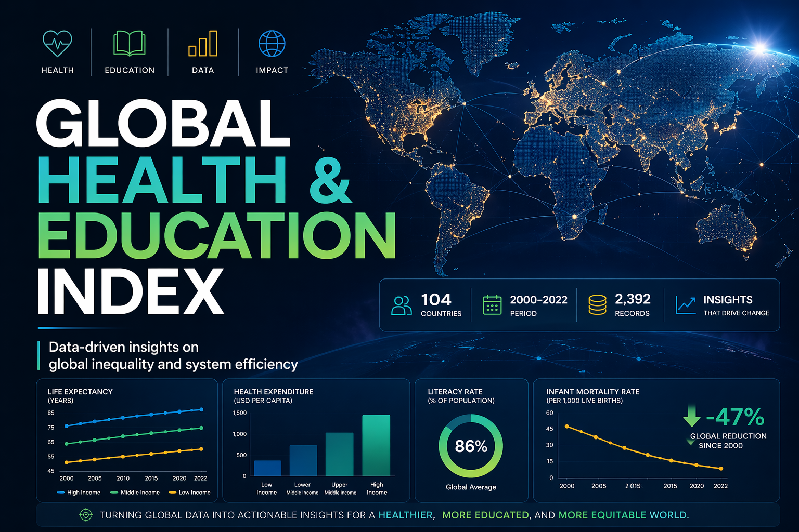
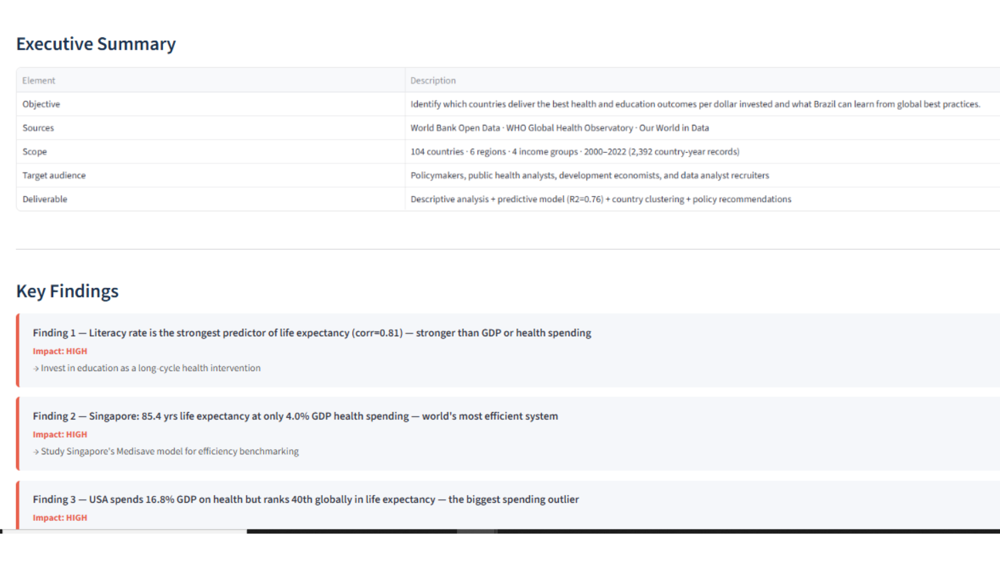
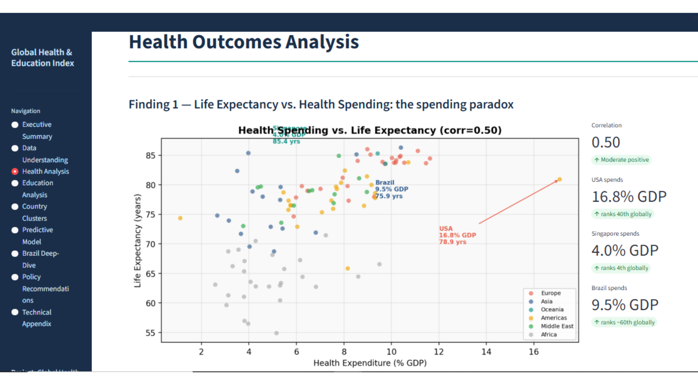
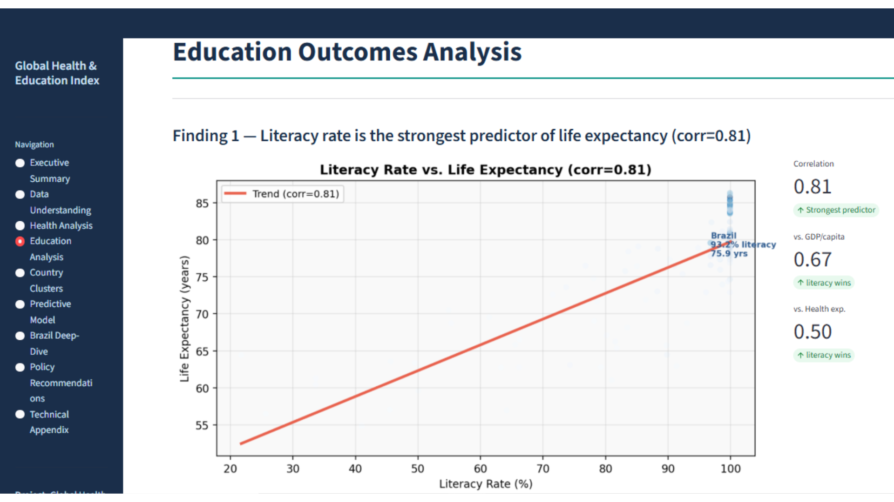
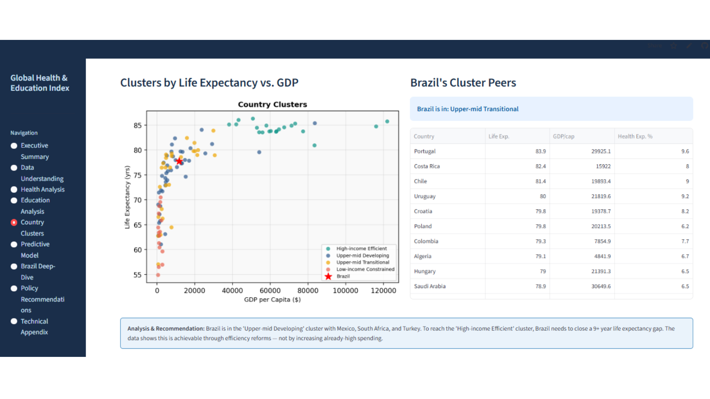

# 🌍 Global Health & Education Index

> Global analysis of health and education outcomes across 104 countries to identify which nations deliver the best results per dollar invested.

---

## 🌐 Live Demo

https://global-health-education-index-6m95ies7piaxjesb5n4dmm.streamlit.app/

em português:
https://global-health-education-index-pvh9avrzlctrbo22v9kkdb.streamlit.app/

---

## 🎯 Overview

Analyze the relationship between education and health indicators across countries to identify global inequality patterns, development gaps, and structural efficiency differences.

This project combines:
- data analysis  
- predictive modeling  
- clustering  
- policy-oriented insights  

---

## 📊 Project Scope

- **Countries:** 104  
- **Period:** 2000–2022  
- **Data sources:** World Bank, WHO, Our World in Data  
- **Records:** 2,392 country-year observations  

---

## 🧠 Key Insights

- Literacy rate is the strongest predictor of life expectancy (corr = 0.81)  
- High spending does not guarantee better health outcomes (USA vs Singapore)  
- Brazil spends at G7 levels but underperforms due to inefficiency  
- Global infant mortality dropped 47%, but inequality remains  

---

## 🧪 What This Project Includes

- Full exploratory analysis  
- Cross-country comparison  
- Predictive model (R² ≈ 0.76)  
- K-Means clustering (4 country profiles)  
- Policy recommendations  

---

## 🖥️ App Structure

The Streamlit app includes:

- Executive summary  
- Data understanding  
- Health analysis  
- Education analysis  
- Country clustering  
- Predictive model  
- Brazil deep-dive  
- Policy recommendations  

---

## 📸 Visuals

  
  
  


---

## 🛠️ Tech Stack

- Python  
- Pandas  
- NumPy  
- Matplotlib  
- Scikit-learn  
- Streamlit  

---

## 🚀 Run Locally

```bash
pip install -r requirements.txt
streamlit run app.py

## 📈 Business Value

This project demonstrates how data analysis can:

- identify inefficiencies in public systems  
- reveal structural inequality across countries  
- support policy decision-making  
- transform raw indicators into actionable insights  

---

## 📬 Contact

Bruno Barradas  
https://github.com/Bruno-Barradas
